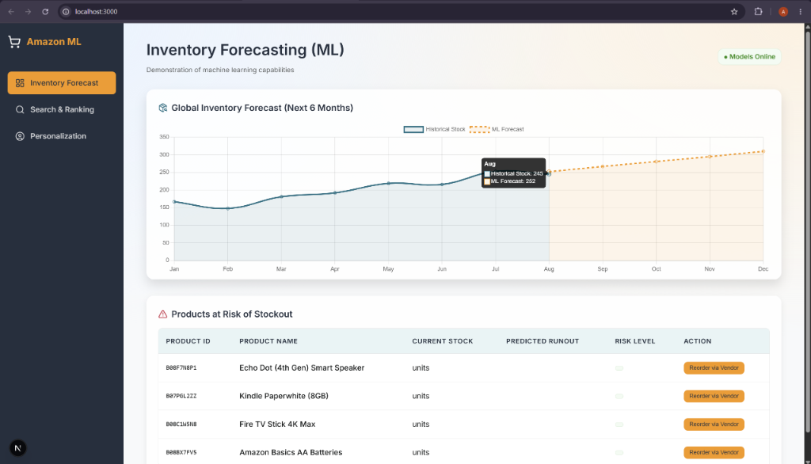
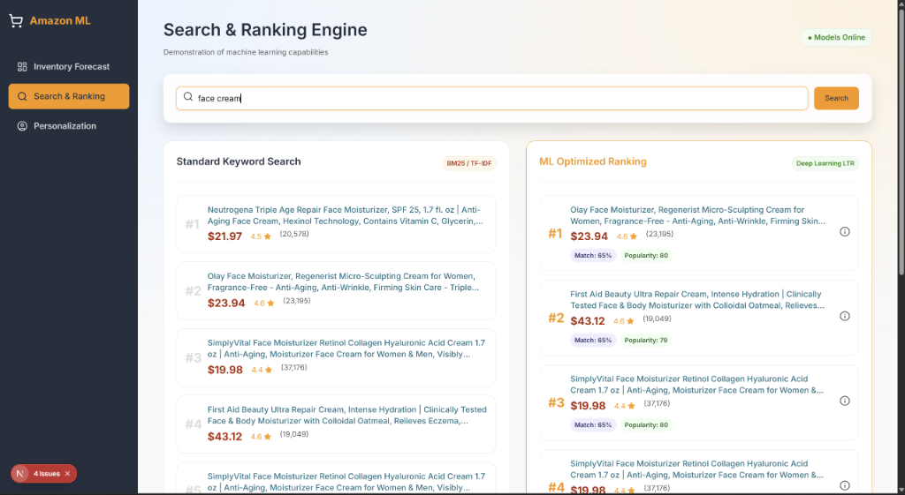
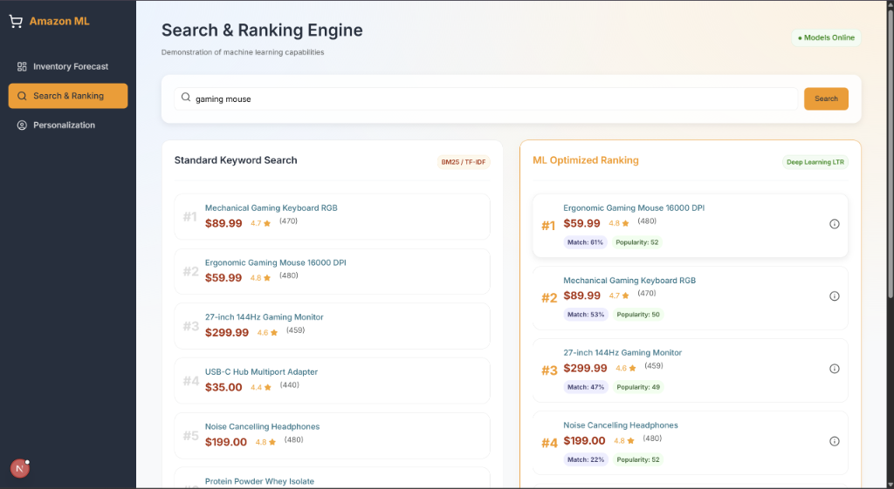
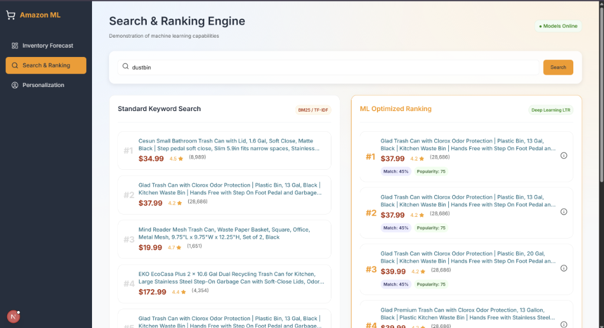
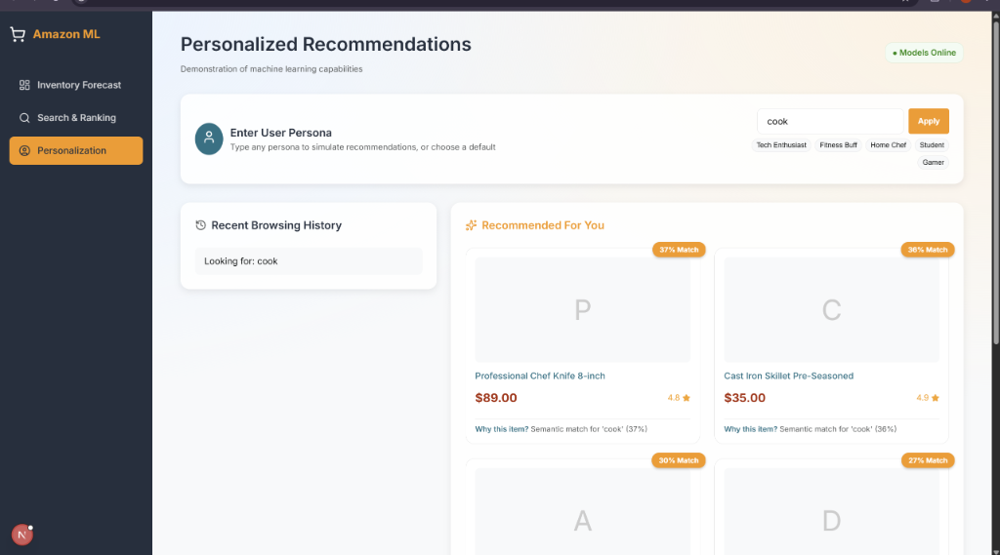

# Amazon ML Dashboard 🚀

A comprehensive, full-stack e-commerce dashboard demonstrating the integration of real Machine Learning capabilities for search optimization, inventory forecasting, and personalized product recommendations.

<div align="center">
  
  
  
  
  
  <!-- More screenshots will be added here -->
</div>

## Overview

The **Amazon ML Dashboard** replaces traditional hardcoded logic and static data with dynamic, data-driven machine learning models. It connects a React-based frontend dashboard (Next.js) with a powerful Python backend that serves real-time ML inferences on simulated live warehouse data and dynamic search queries.

### Key Features

*   **Intelligent Search (Semantic Matching):** Uses `sentence-transformers` (`all-MiniLM-L6-v2`) to compute real semantic similarity scores between user search queries and live product titles (fetched via the Rainforest API). Products are ranked not just by keyword, but by contextual meaning and calculated popularity.
*   **Predictive Inventory Forecasting:** Replaces static inventory numbers with a dynamically trained **Linear Regression** model (`scikit-learn`). It analyzes generated historical warehouse trends to forecast future stock levels dynamically.
*   **Personalized Recommendations (Content-Based Filtering):** Uses TF-IDF (`scikit-learn`) to vectorize a user persona's purchase history against the active product catalog. It surfaces recommendations based on true mathematical cosine similarity to a user's past behavior.
*   **Dynamic Data Generation:** An overhauled SQLite initialization script (`amazon_ml.db`) continuously generates trend-based historical data to simulate a live production environment.

## Project Structure

The repository is split into two primary applications:

*   **/amazon-ml-backend**: The Python backend powering the ML models, API endpoints, and database interactions.
*   **/amazon-ml-dashboard**: The Next.js frontend user interface for interacting with the search, viewing inventory predictions, and exploring personalized recommendations.

## Tech Stack

*   **Backend:** Python, SQLite
*   **Machine Learning:** `scikit-learn`, `sentence-transformers`, `numpy`, `pandas`
*   **External APIs:** Rainforest API (for live Amazon product data)
*   **Frontend:** Next.js (React)

## Setup & Installation

### Backend Setup

1.  Navigate to the backend directory:
    ```bash
    cd amazon-ml-backend
    ```
2.  Install the required dependencies (it is recommended to use a virtual environment):
    ```bash
    pip install -r requirements.txt
    ```
    *(Ensure dependencies like `scikit-learn`, `sentence-transformers`, `numpy`, and `pandas` are installed).*
3.  Initialize the database and start the server:
    ```bash
    python main.py
    ```

### Frontend Setup

1.  Navigate to the dashboard directory:
    ```bash
    cd amazon-ml-dashboard
    ```
2.  Install dependencies:
    ```bash
    npm install
    ```
3.  Start the development server:
    ```bash
    npm run dev
    ```

## API Endpoints Overview

*   `GET /api/search?query={text}`: Returns search results augmented with `semantic_score` and `popularity_score`.
*   `GET /api/inventory`: Triggers the training of the linear regression model and returns historical and forecasted stock levels.
*   `GET /api/recommendations`: Calculates TF-IDF vectors based on the active user persona and returns personalized product matches.

## Future Enhancements

*   Integration with a production database (e.g., PostgreSQL or AWS RDS).
*   Switching to cloud-based LLM APIs (like Gemini API) for reduced local compute load.
*   Expanding the persona profiles and adding collaborative filtering to the recommendation engine.

---
*Generated as part of the Amazon ML Dashboard Overhaul project.*
